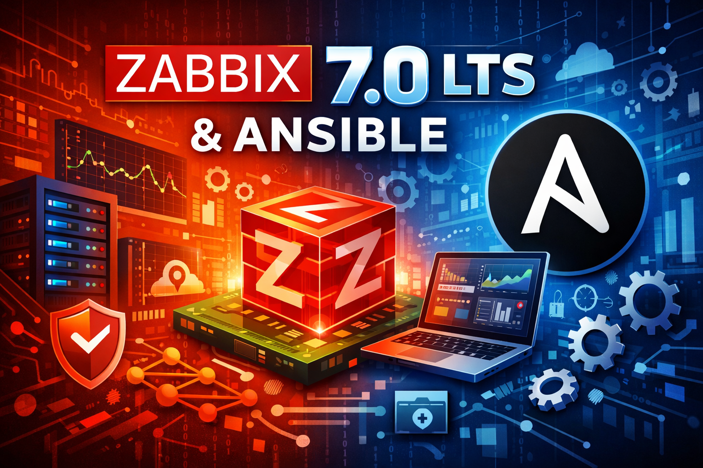

# Zabbix a Ansible

Small project for this event

## První kroky s Ansible a Zabbix agent2 a template



- Zabbix enterprise-class open source distributed monitoring solution - [Zabbix Appliance](https://www.zabbix.com/documentation/7.0/en/manual/appliance)
- Vagrant utility for managing virtual machines - [Vagrant](https://developer.hashicorp.com/vagrant)
- Vagrant box from [bento](https://github.com/chef/bento) - [bento/ubuntu-24.04](https://portal.cloud.hashicorp.com/vagrant/discover/bento/ubuntu-24.04)
- Red Hat Ansible Automation Platform - [Ansible](https://www.redhat.com/en/technologies/management/ansible)
- Linux Ubuntu distribution - [Ubuntu server](https://ubuntu.com/server)
- AlmaLinux distribution - [AlmaLinux OS](https://almalinux.org)

## Example

```console
vagrant up
vagrant ssh
sudo su -
cd /opt/repo/
ansible-playbook -i inventory.ini -l ansible configure_servers.yml
```
...
